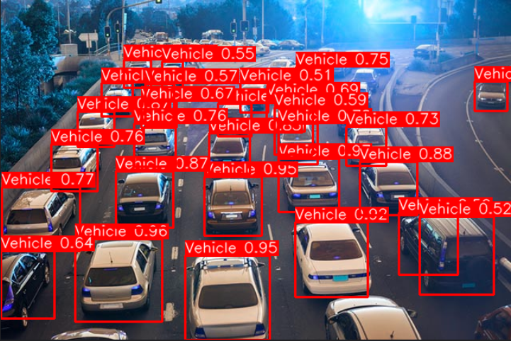

# RetinaNet with EfficientNet Backbone on Custom Datasets

This project is an implementation and significant enhancement of an object detection model based on RetinaNet. It builds upon the foundational PyTorch implementation by [zylo117/pytorch-retinanet](https://github.com/zylo117/pytorch-retinanet) and introduces several major modifications to modernize the architecture, improve performance, and streamline the workflow for training and evaluation on custom datasets.

The core of this project is a hybrid model that combines the powerful, lightweight **EfficientNet-B0** backbone with a Feature Pyramid Network (FPN) and the RetinaNet detection heads, trained with a Focal Loss function.




## Major Modifications and Features

This repository includes several key improvements over the original implementation:

1.  **EfficientNet Backbone**: Integrated `EfficientNet-B0` as a modern, high-performance alternative to the original ResNet backbones, using pre-trained ImageNet weights for effective feature extraction.
2.  **Advanced Data Augmentation**: Replaced the basic augmenter with a powerful pipeline from the **Albumentations** library, including geometric transforms (ShiftScaleRotate), color jittering, noise, and robust occlusion handling (CoarseDropout).
3.  **Robust Training and Evaluation Workflow**:
    *   **Early Stopping**: Training automatically stops if the validation mAP does not improve for a set number of epochs, saving compute time and preventing overfitting.
    *   **Best Model Saving**: The model checkpoint with the highest validation mAP is automatically saved as `best_model.pt`.
    *   **CSV Logging**: Key training metrics (loss, mAP, learning rate) are saved to a `training_log.csv` after each epoch for easy analysis and plotting.
4.  **Granular Model Freezing**: Added command-line flags (`--freeze_backbone`, `--freeze_fpn`, etc.) to allow for staged fine-tuning—a powerful technique for transfer learning.
5.  **Comprehensive Evaluation**: The `csv_eval.py` script calculates and reports key performance metrics, including:
    *   `mAP` (at a given IoU threshold)
    *   Overall Precision
    *   Overall Recall
6.  **Notebook-Friendly Visualization**: Modernized visualization scripts (`visualize_single_image.py`) that are fully compatible with Jupyter/Kaggle notebooks, using `matplotlib` and `IPython.display` instead of `cv2.imshow()`.
7.  **YOLO Format Support**: An evaluation script (`benchmark_yolo.py`) to correctly calculate metrics for validation sets annotated in the popular YOLO format (`.txt` files).

## Setup and Installation

### 1. Clone the Repository
First, clone this repository to your local machine or Kaggle environment.

```bash
git clone https://github.com/dheeraj2309/pytorch-retinanet.git
cd pytorch-retinanet
```

### 2. Install Dependencies
This project requires Python 3.8+ and several packages. You can install them all using `pip`. It is highly recommended to use a virtual environment.

The following command installs PyTorch with CUDA 11.8 support, which is common on modern GPUs and cloud platforms like Kaggle. Adjust the CUDA version if needed.

```bash
# Install PyTorch 
pip install torch torchvision torchaudio 

# Install other required packages
pip install numpy pandas matplotlib scikit-image opencv-python pycocotools albumentations
```

Alternatively, you can create a `requirements.txt` file and install from it:
```
# requirements.txt
torch
torchvision
numpy
pandas
matplotlib
scikit-image
opencv-python
pycocotools
albumentations
```
And run `pip install -r requirements.txt`.

## How to Use

### 1. Data Preparation (CSV Format)

This project is designed to work seamlessly with custom datasets in a simple CSV format.

**a) The Class File (`--csv_classes`)**
Create a file (e.g., `classes.csv`) that maps your class names to integer IDs, starting from 0.
*Format: `class_name,id`*

```csv
# Example: classes.csv
car,0
person,1
truck,2
```

**b) The Annotations File (`--csv_train` or `--csv_val`)**
Create a file containing your bounding box annotations. The image paths should be absolute or relative to where you run the script.
*Format: `path/to/image.jpg,x1,y1,x2,y2,class_name`*

*   `(x1, y1)`: top-left corner pixel coordinates.
*   `(x2, y2)`: bottom-right corner pixel coordinates.

```csv
# Example: annotations.csv
data/train/img_01.jpg,112,150,340,400,car
data/train/img_01.jpg,450,80,600,350,person
data/train/img_02.jpg,88,92,550,580,truck
```

### 2. Training a Model

Use the `train.py` script to train your model. The following is a recommended command for a first run.

```bash
python train.py \
    --dataset csv \
    --csv_train /path/to/your/train_annotations.csv \
    --csv_val /path/to/your/val_annotations.csv \
    --csv_classes /path/to/your/classes.csv \
    --backbone efficientnet-b0 \
    --epochs 50 \
    --checkpoint_path checkpoints/my_first_run \
    --early_stopping_patience 10
```

**Key Training Arguments:**
*   `--backbone`: Choose the model backbone (`efficientnet-b0`, `resnet50`, etc.).  
*   `--epochs`: Maximum number of training epochs.  
*   `--checkpoint_path`: Directory to save model checkpoints and logs.  
*   `--early_stopping_patience`: Stop training if validation mAP doesn't improve for this many epochs.  
*   `--freeze_backbone`: (Optional) Freeze backbone weights and only train the FPN and detection heads. Ideal for an initial training stage.  

### 3. Evaluating Model Performance (Qualitative Analysis)

Use the `csv_validation.py` script to get a full performance report on your validation set.  

```bash
python csv_validation.py \
    --model_path /path/to/your/checkpoints/my_first_run/best_model.pt \
    --csv_annotations /path/to/your/val_annotations.csv \
    --class_list /path/to/your/classes.csv \
    --iou_threshold 0.5 \
    --score_threshold 0.5
```

This will output a summary of the key metrics based on the specified thresholds.

### 4. Visualizing Detections (Qualitative Analysis)

Use the `visualize_single_image.py` script to see your model's predictions on individual images. This is excellent for qualitative analysis and debugging. This script is designed to be imported and run from a Jupyter/Kaggle notebook.

**Example Notebook Cell:**
```python
from visualize_single_image import visualize_single_image

# Define paths and parameters
IMAGE_TO_TEST = '/path/to/your/test_image.jpg'
CLASSES_FILE = '/path/to/your/classes.csv'
MODEL_FILE = '/path/to/your/checkpoints/my_first_run/best_model.pt'
SCORE_THRESHOLD = 0.5

# Run the visualization
visualize_single_image(
    image_path=IMAGE_TO_TEST,
    model_path=MODEL_FILE,
    class_list_path=CLASSES_FILE,
    score_threshold=SCORE_THRESHOLD
)
```

## Acknowledgements

This project is based on the work from [zylo117/pytorch-retinanet](https://github.com/zylo117/pytorch-retinanet). Many thanks to the original author for providing a clean and understandable implementation.
